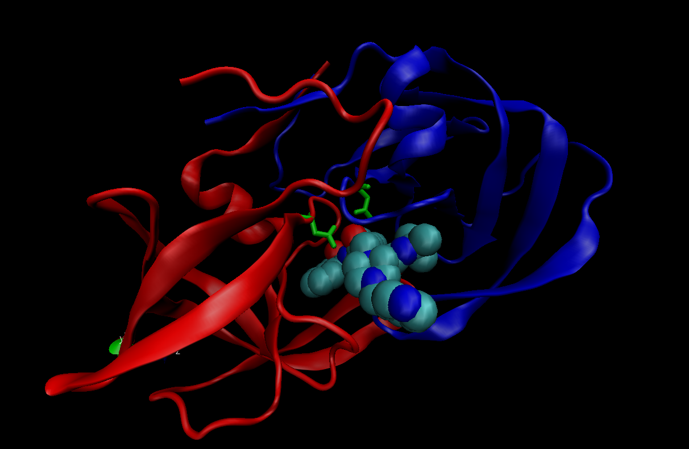

```{r}
db <- read.csv("Data Export Summary.csv")
db
```

```{r}
round((sum(db$X.ray)/sum(db$Total))*100, 2)

```

```{r}
round((sum(db$EM)/sum(db$Total))*100, 2)
```

**Q1** 87.53% and 4.95% respectively

```{r}
round(db$Total[1]/sum(db$Total) *100, 2)
```

**Q2** 87.35%



# Using Bio3D in R for structural bioinformatics

```{r}
library(bio3d)
pdb <- read.pdb("1hel")
pdb
```
```{r}
pdb$atom
```

Do a Normal mode analysis (NMA) a prediction of the conformational variability and intrinsic dynamics of this protein.
```{r}
m <- nma(pdb)
plot(m)
```
```{r}
mktrj(m, file="nma.pdb")
```


***Comparative Structure Analysis***


Start by getting a sequence of interest.

```{r}
aa <- get.seq("1ake_A")
aa
```
I want to search the PDB database for sequence like my aa sequence.
```{r}
blast <- blast.pdb(aa)
hits <- plot(blast)
```

```{r}
hits$pdb.id
```


```{r}
files <- get.pdb(hits$pdb.id, path="pdbs", split=TRUE, gzip=TRUE)
```

Now we want to align all these structures. We will use the function 'pdbaln()' 

```{r}
pdbs <- pdbaln(files, fit=TRUE)
```
```{r}
pdbs
```
```{r}
ids <- basename.pdb(pdbs$id)
plot(pdbs, label=ids)
```

Principal component analysis (PCA)

```{r}
pc <- pca(pdbs)
plot(pc)
```
Let's visualize the displacements (i.e. movements of the structure) that are captured by PC1

```{r}
mktrj(pc, pc=1, file="pca.pdb")
```

Saving important results

```{r}
#save(blast, hits, pca, file="myresults.RData")
#+load("myresults.RData")
```


